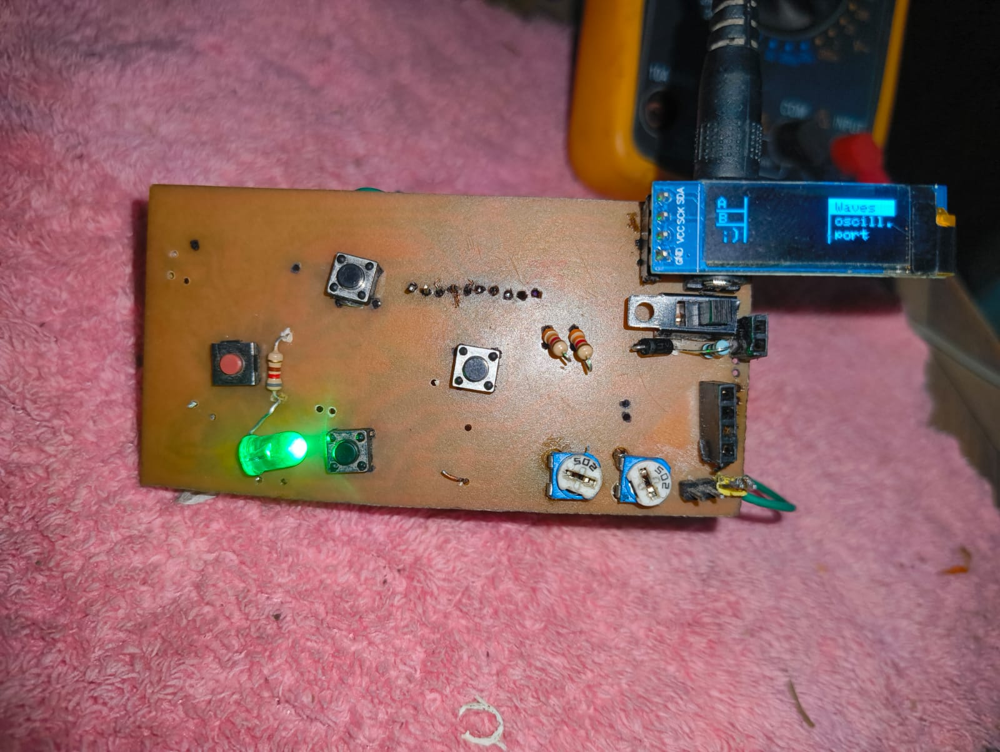
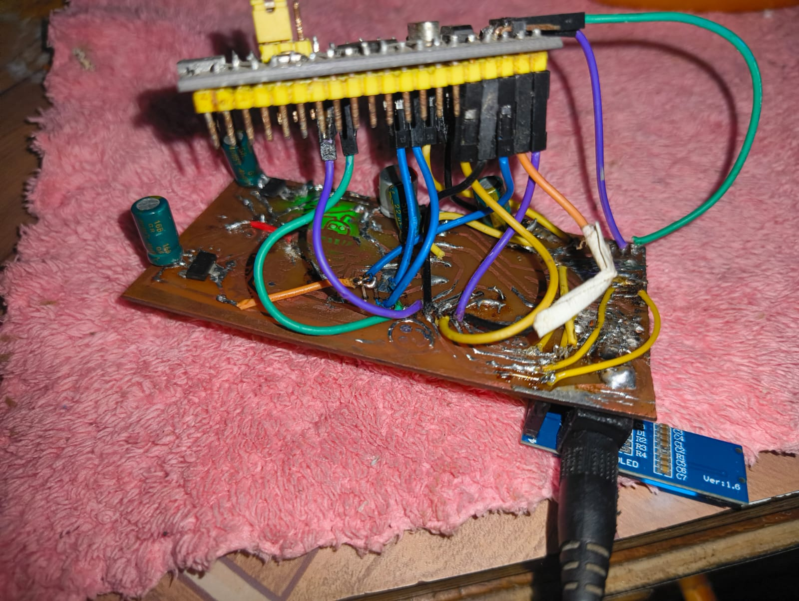

# Function Generator PCB

A compact 2-layer signal generator board designed in **KiCad**, driven by an **STM32** microcontroller. Generates sine, square, and triangle waveforms with adjustable frequency and amplitude via onboard potentiometers, with waveform selection and parameter control through tactile pushbuttons. Output waveform and settings are displayed in real time on an **SSD1306 OLED** over I²C.

---

## Board Overview

| Parameter | Value |
|---|---|
| Board Size | 90.4 × 45.0 mm |
| Layers | 2 (F.Cu + B.Cu) |
| Substrate | FR4, 1.6 mm |
| EDA Tool | KiCad 10.0 |
| Total Footprints | 23 |

---

## Hardware Design

### Key Components

- **STM32** MCU — Cortex-M3; DAC output for waveform generation, ADC input for amplitude sensing (PC13)
- **AMS1117-3.3** — 3.3 V LDO for MCU and OLED
- **AMS1117-5.0** — 5 V LDO from barrel jack input
- **AMS1117 (adjustable)** — Adjustable rail for analog output biasing (ADJ_IN / ADJ_OUT)
- **1N4007** — Reverse polarity protection on the input
- **SSD1306 OLED (128×64)** — I²C display for waveform type, frequency, and mode
- **2× Potentiometers** — Frequency sweep and amplitude control
- **3× Tactile Switches** — Waveform select, mode toggle, reset
- **SPDT Slide Switch** — Power enable
- **Barrel Jack (DC 5V)** — Main power input
- **Status LED** — 3.3 V power-on indicator

### Signal Path

```
VIN (5V) → 1N4007 → AMS1117-5.0 → AMS1117-3.3 → STM32
                                                     │
                                                  DAC OUT
                                                     │
                                              Signal Output Header
```

The adjustable LDO (ADJ_IN_PC13) allows the STM32 to digitally trim the output reference voltage, enabling software-controlled amplitude adjustment without external op-amps.

### Interface

- `SDA` / `SCK` — I²C bus to SSD1306 OLED
- `ADJ_IN_PC13` — Analog input from potentiometer to STM32 ADC
- `ADJ_OUT` — DAC signal output to signal output header
- `S_IN` / `S_OUT` — SPI-capable auxiliary signal lines
- `SWIO`, `SWCLK` — SWD programming header

---

## PCB Photos

### Etched Copper (Initial Design)

Chemical etching on bare copper-clad board. The irregular copper artwork visible on the surface is a KiCad-generated decorative pattern intentionally placed on the copper layer — a signature touch on the initial prototype.


---

### Assembled Front Side

All components populated: STM32, OLED header, potentiometers, tactile switches, LED, and LDO regulators. The SSD1306 OLED is visible at the top right, showing the menu screen (`Waves / Oscill. / Port`).



---

### Back Side — Wiring and Connections

Back of the board with visible solder joints, STM32 Blue Pill seated in its socket, capacitor on the power rail, and colour-coded jumper wires running to peripheral headers. The STM32 module is stacked above the board via pin headers.



---

## Design Highlights

- Three separate voltage rails (VIN, 5V, 3.3V) with staged LDOs and decoupling caps at each stage
- OLED I²C lines pulled up on the PCB — no external pull-up resistors needed
- Potentiometer wiper lines routed directly to STM32 ADC pins with short, low-impedance traces
- Reverse-polarity protection with 1N4007 at input — safe for bench use
- All headers on 2.54 mm pitch for easy probing and fly-lead attachment

---

## KiCad Source Files

Full schematic and layout are in the [`kicad/`](kicad/) subfolder:

```
kicad/
├── oscilloscope_power_other.kicad_sch   # Schematic
└── oscilloscope_power_other.kicad_pcb   # PCB layout
```

> Open with **KiCad 10.0** or later.
