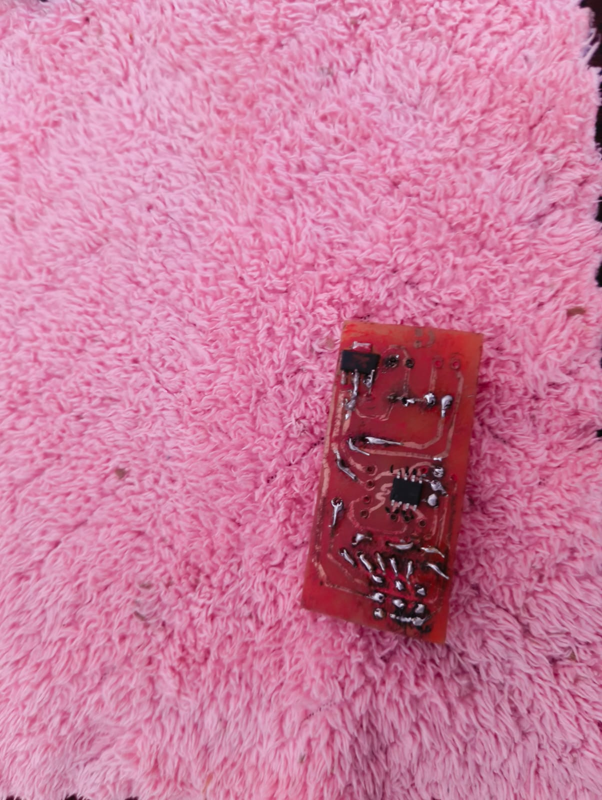
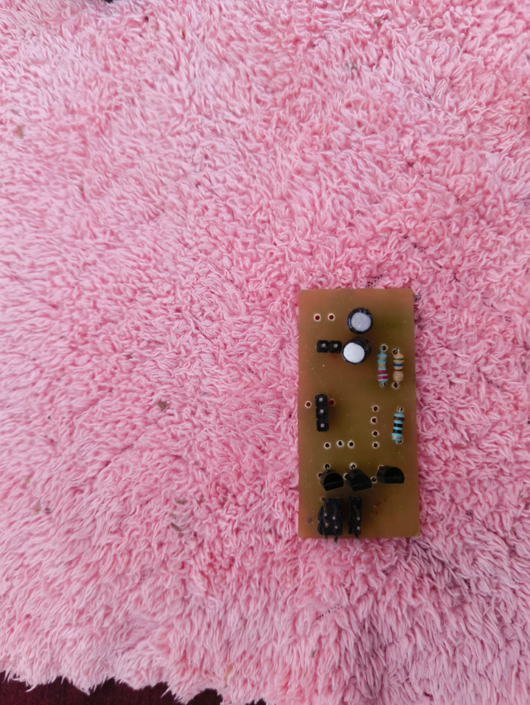

# Writing Machine PCB

A compact 2-layer motor driver board designed in **KiCad** for a **2-DOF polar-arm plotter** — a machine that draws or writes text and images by controlling two servo/stepper axes. The board manages three independent motor channels through **2N2219 NPN BJT** switches driven by an **STC8G1K08A** 8-bit MCU, with an onboard 5 V power rail and UART communication for receiving drawing commands from a host PC.

---

## Board Overview

| Parameter | Value |
|---|---|
| Board Size | 56.2 × 26.0 mm |
| Layers | 2 (F.Cu,B.Cu) |
| Substrate | FR4, 1.6 mm |
| EDA Tool | KiCad 10.0 |

---

## Hardware Design

### Key Components

- **STC8G1K08A-36I-DFN8** — 8-bit 8051-core MCU in DFN-8 package; 3 PWM/GPIO outputs controlling motor channels `t1`, `t2`, `t3`
- **2N2219 NPN BJT** (×3) — High-current switching transistors driving each motor coil or solenoid; base driven from MCU GPIO through current-limiting resistors
- **AMS1117-5.0** — 5 V LDO from VIN; powers both the MCU and motor driver stage
- **Electrolytic capacitor** — Bulk decoupling on the 5 V rail to absorb motor switching transients
- **Status LED** — Power/activity indicator
- **UART header** — `TX` / `RX` lines for serial command input from host PC or Raspberry Pi
- **Motor output headers** — `signal1`, `signal2`, `signal3` — routed to individual 3-pin motor connectors (`s1` switching each channel)

### Motor Drive Topology

Each axis uses a simple **BJT low-side switch**:

```
MCU GPIO (t1/t2/t3)
        │
      [R_base]
        │
      2N2219 Base
      2N2219 Collector ← Motor coil / solenoid (signal1/2/3)
      2N2219 Emitter  → GND
```

The MCU drives the base high to sink current through the motor coil. Flyback is handled at the motor connector level.

### Communication Interface

- `TX` / `RX` — UART from the host; the MCU receives G-code-style or raw coordinate commands and converts them to PWM duty cycles on the three output channels
- `5v` / `gnd` — Power header for host-side logic level matching

---

## PCB Photos

### Assembled Front Side

STC8G1K08A MCU (DFN-8 SMD package) soldered at centre. Base resistors for all three 2N2219 channels routed symmetrically. The red soldermask is a deliberate visual choice — high contrast for easy inspection under a loupe.



---

### Component Side (Back)

THT side showing all three **2N2219** transistors in TO-39 cans, the AMS1117-5.0 LDO, bulk electrolytic cap, LED, and 3-pin motor output connectors. Compact 26 mm board width keeps the plotter's carriage mount small.



---

## Design Highlights

- DFN-8 MCU footprint keeps the board under 30 mm wide — fits directly on the plotter arm without additional mounting hardware
- Three identical BJT switch stages are mirrored in layout, making bring-up and debugging methodical
- UART header placed at board edge for easy cable routing off the moving arm
- AMS1117-5.0 with bulk cap handles the inrush current from all three motor coils switching simultaneously
- The polar arm's IK pipeline runs on the host; the board only handles PWM output — clean separation of concerns

---

## Related Repository

The full writing machine project (Python inverse-kinematics pipeline, G-code parser, firmware) lives here:
👉 [github.com/yogendra-kumawat/Writing-machine](https://github.com/yogendra-kumawat/Writing-machine)

---

## KiCad Source Files

Full schematic and layout are in the [`kicad/`](kicad/) subfolder:

```
kicad/
├── writin machine 3.0.kicad_sch   # Schematic
└── writin machine 3.0.kicad_pcb   # PCB layout
```

> Open with **KiCad 10.0** or later.
